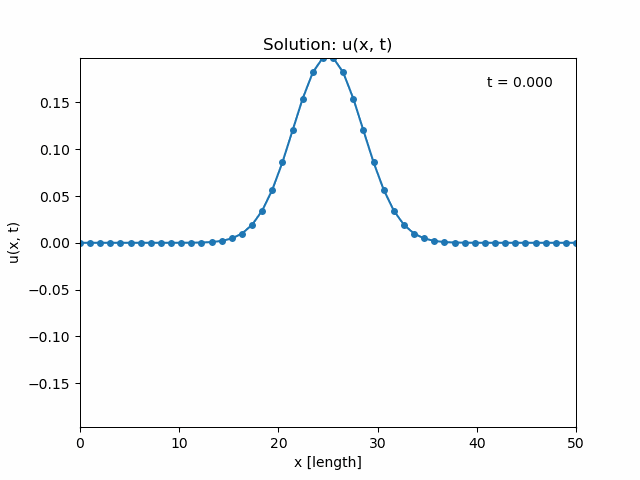

# diff-eq-solver

An application that uses the finite difference method to solve various types of differential equations, such as the
heat equation and wave equation. The solution is written to a table in an Excel file, and the solution is visually 
displayed on a plot. For time dependent PDEs, the plot is animated.  

## How to run locally
```
# Install requirements
pip3 install -r requirements.txt

# Run program
python3 app.py
```

## Snapshots
<p align="center">
  
  
  
</p>
